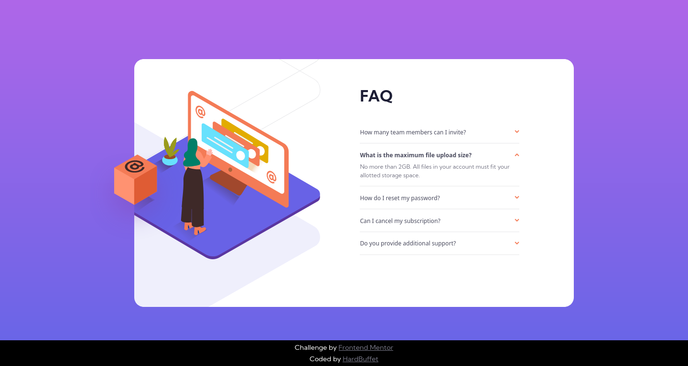

# Frontend Mentor - FAQ accordion card

## Welcome! 👋

Thanks for checking out this front-end coding challenge.

[Frontend Mentor](https://www.frontendmentor.io) challenges help you improve your coding skills by building realistic projects.

## Table of contents

- [Overview](#overview)
  - [The challenge](#the-challenge)
  - [Screenshot](#screenshot)
  - [Links](#links)
- [My process](#my-process)
  - [Built with](#built-with)
- [Author](#author)

## Overview

### The challenge

Your challenge is to build out this FAQ accordion card and get it looking as close to the design as possible.

You can use any tools you like to help you complete the challenge. So if you've got something you'd like to practice, feel free to give it a go.

Your users should be able to:

- View the optimal layout for the component depending on their device's screen size
- See hover states for all interactive elements on the page
- Hide/Show the answer to a question when the question is clicked
- **Bonus**: Complete the challenge without using JavaScript

Want some support on the challenge? [Join our Slack community](https://www.frontendmentor.io/slack) and ask questions in the **#help** channel.

### Screenshot

### Links

- Solution URL: [Frontend Mentor](https://www.frontendmentor.io/solutions/faq-accordion-card-Z6pgf0Gjdh)
- Live Site URL: [GitHub pages](https://hardbuffet.github.io/faq-accordion-card/)

## My process

### Built with

- Semantic HTML5 markup
- CSS custom properties
- Flexbox
- CSS Grid
- Mobile-first workflow
- SASS
- PUG
- BEM

## Author

- CodePen - [@HardBuffet](https://codepen.io/HardBuffet)
- Frontend Mentor - [@HardBuffet](https://www.frontendmentor.io/profile/HardBuffet)
